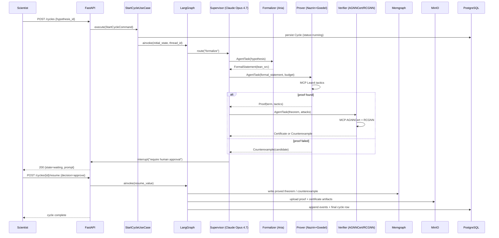
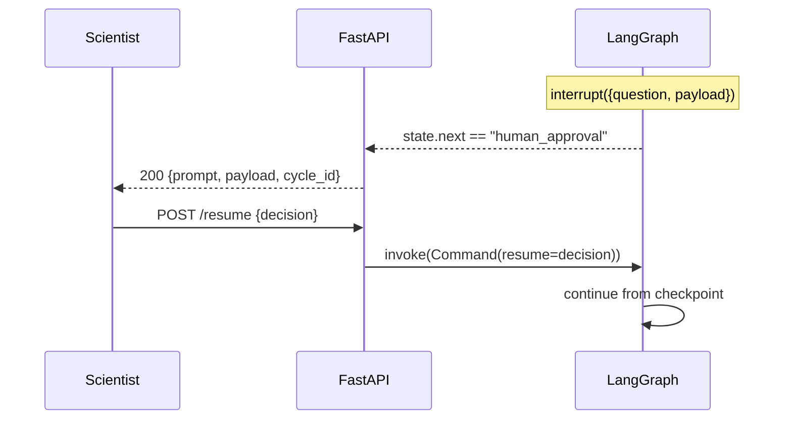

# ARCHITECTURE — Dijla PoC Scientific Platform

## 1. Guiding Principles

* **Clean Architecture** with explicit dependency direction (outer rings depend
  on inner rings only).
* **Domain-Driven Design** — bounded contexts: `proving`, `certification`,
  `knowledge`, `orchestration`.
* **Event-sourced cycles** — every agent decision, tool call, MCP response, and
  HITL approval is appended to an immutable `events` table, giving the platform
  a complete *digital trail* that can be replayed.
* **Binary scientific outcome** — for any `Theorem` × `Attack` pair the verifier
  must return `proved | refuted | open`. Probabilistic LLM outputs never reach
  the final ledger without passing through a deterministic Lean 4 / AGNNCert /
  RCGNN check.
* **Async-first** — `asyncio` everywhere I/O happens (DB, MCP, FastAPI). CPU
  bound work (currently mock-only) is dispatched to a thread pool with
  `asyncio.to_thread`.

## 2. Layered Structure

```
src/dijla/
├── domain/                 # Pure domain: entities, value objects, errors
│   ├── entities/
│   ├── value_objects/
│   ├── events/
│   └── repositories.py     # Abstract repository protocols
├── application/            # Use cases / orchestration boundary
│   ├── use_cases/
│   ├── dto.py
│   └── services/
├── orchestration/          # LangGraph supervisor + agents (cross-cutting)
│   ├── state.py
│   ├── graph.py
│   ├── agents/
│   ├── memory/             # Checkpointer + BaseStore adapters
│   └── prompts/
├── mcp_servers/            # MCP server entry points (lean4, agnncert, rcgnn)
├── infrastructure/         # Concrete adapters
│   ├── persistence/        # PostgreSQL (SQLAlchemy 2) repositories
│   ├── graph/              # Memgraph adapter
│   ├── object_store/       # MinIO adapter
│   ├── mcp_clients/        # MCP client wrappers per server
│   └── models/             # Model adapter implementations (mock + real stubs)
├── presentation/
│   └── api/                # FastAPI routes, dependencies, schemas
├── core/                   # Cross-cutting: logging, settings, errors
└── main.py                 # `uvicorn dijla.main:app`
```

The dependency graph is strictly **inward**:
`presentation → application → domain`, `infrastructure → domain`, and
`orchestration` is allowed to depend on `application` + `domain` only.
`infrastructure` and `mcp_servers` never import `orchestration`.

## 3. Data Flow — One Spiral Iteration



## 4. MCP Integrations

Three MCP servers are shipped in `src/dijla/mcp_servers/`. They are built on the
official Python `mcp` SDK and run as **stdio** servers in the sandbox (a single
`asyncio` task per server). In production they are also exposed as
**streamable-http** services so external scientists can introspect them.

| Server | Tools | Backend (sandbox) | Backend (production) |
|---|---|---|---|
| `mcp-lean4` | `check_tactic`, `apply_tactic`, `verify_term`, `lean_search` | In-memory Lean term reducer with a curated tactic library | LeanDojo + `lake env lean` inside a Docker sandbox |
| `mcp-agnncert` | `certify_node`, `certify_graph`, `sample_attack` | Deterministic mock implementing the AGNNCert algebra | Real AGNNCert wheel + GPU |
| `mcp-rcgnn` | `certify_injection`, `compute_radius` | Deterministic mock matching the RCGNN paper | Real RCGNN wheel + GPU |

Every MCP call is logged as a `ToolInvocation` event and serialized into the
cycle's event ledger. Tools are idempotent on `(inputs_hash)` — repeated calls
in a replay return the cached response from `MinIO`.

### Why MCP (and not direct function calls)

* **Tool sandboxing** — Lean tactics can run unbounded; MCP gives us per-call
  timeouts, stdout capture, and an explicit JSON schema for every tool.
* **Reusability** — the same MCP server is consumed by the orchestrator, the
  Critic agent (for reflection on tool errors), *and* exposed to an external
  Claude Desktop / Cursor user as a stand-alone integration.
* **Determinism** — MCP tool responses are content-addressable and cacheable.

## 5. Memory Management

| Layer | Implementation | Purpose |
|---|---|---|
| **Within-cycle** | `AsyncPostgresSaver` (LangGraph Checkpointer over the `langgraph_checkpoints` table) | Per-thread state, supports replay & resume after a crash |
| **Cross-session** | `AsyncPostgresStore` (LangGraph BaseStore) | Long-term memory: `(namespace, key) → JSON`; we use namespaces `tactics`, `counterexamples`, `theorems` |
| **Knowledge** | Memgraph via `gqlalchemy` | Typed graph: `(Theorem)-[:USES]->(Tactic)`, `(Theorem)-[:REFUTED_BY]->(Counterexample)`, `(GNNModel)-[:CERTIFIED_BY]->(Certificate)` |
| **Artifacts** | MinIO buckets `proofs`, `certificates`, `attacks`, `models` | Immutable artifact storage, content-addressed by SHA-256 |
| **Operational** | PostgreSQL via SQLAlchemy 2 async | Cycles, events, hypotheses, theorems metadata |

The combination implements the **self-amplifying spiral**: a successful proof
writes a `Tactic` row into the `tactics` namespace of the `BaseStore`, which the
Prover agent pulls in on subsequent runs as few-shot retrieval. Counterexamples
are written to `counterexamples` namespace and surface to the *Critic* agent at
the start of every cycle.

## 6. Human-in-the-Loop (HITL)

LangGraph's `interrupt()` is used at two checkpoints:

1. **After formalization** — the scientist confirms the Lean 4 statement matches
   their intent. This guards against silent semantic drift in the Formalizer.
2. **Before commit** — once a proof + certificate pair is ready, the scientist
   approves writing it to the Memgraph KG (and thereby influencing all future
   cycles).

The interrupt payload is persisted; the orchestrator yields control with a
`waiting_for_human` cycle status. The scientist's response is delivered via
`POST /cycles/{id}/resume` with a `Command(resume=...)` value.



## 7. Architectural Decisions (ADR-style summary)

| # | Decision | Rationale |
|---|---|---|
| ADR-01 | uv + `pyproject.toml` (PEP 621) | uv is the 2026 default for fast, reproducible Python tooling. |
| ADR-02 | LangGraph Supervisor with tool-calling | Recommended 2026 pattern; gives a single rationaliser (Claude Opus 4.7) full visibility while keeping agents specialized. |
| ADR-03 | All tool calls go through MCP | Sandboxing, reusability, determinism (see §4). |
| ADR-04 | PostgreSQL for both operational + LangGraph checkpoints | One DB to operate; transactional consistency between events and checkpoints. |
| ADR-05 | Memgraph (not Neo4j) | Cypher-compatible, in-memory, far lower latency for the recursive `MATCH p=(a)-[*]->(b)` queries used by the Critic. |
| ADR-06 | Event sourcing for cycles | Required for replay, audit, and the "binary scientific outcome" property — we never overwrite history. |
| ADR-07 | Pydantic v2 + msgspec for hot paths | Pydantic for boundaries, msgspec for the LangGraph state where serialization overhead matters. |
| ADR-08 | Mock model adapters in sandbox | Real Goedel-Prover-V2-32B / Aria / Claude Opus 4.7 require GPUs or paid API keys not available in the sandbox. Adapters are interface-compatible so production deploys swap them out without touching orchestrator code. |
| ADR-09 | Async everywhere I/O | All MCP, DB, and HTTP calls are async; CPU-bound mock prover dispatches to `asyncio.to_thread`. |
| ADR-10 | Ruff (v0.15+) + MyPy (strict) | Single linter+formatter, strict typing across `src/`. |
| ADR-11 | Hypothesis sources are explicit (user / system / spiral) | The PoC must explain *where science begins*. Source is a first-class field on `Hypothesis`. |
| ADR-12 | Docker-compose for the dev environment | Brings up Postgres / Memgraph / MinIO / MCP servers in one command, matching the production topology. |

## 8. Sandbox Limitations & Mocks (per Instruction 9)

The following components are mocked **with adapter interfaces preserved** so
production deploys swap them out without changing orchestrator code or
contracts:

* **Claude Opus 4.7 (Supervisor)** — replaced by a deterministic
  `SupervisorPolicy` that routes by `cycle.next_step` derived from the previous
  agent's output. Production wires `langchain-anthropic` to the same protocol.
* **Aria Formalizer** — replaced by a templated Lean 4 statement generator that
  consumes the hypothesis text and emits a syntactically valid Lean 4 stub.
* **Goedel-Prover-V2-32B + Nazrin Prover** — replaced by a tactic-library
  search that succeeds on known patterns and emits `Counterexample` otherwise.
* **Real AGNNCert / RCGNN binaries** — replaced by a deterministic Python
  implementation of the *certificate algebra*: it returns `Certificate(verdict,
  radius)` for any `(model, attack)` pair using a closed-form bound that the
  paper proves is sound.
* **Lean 4 toolchain** — replaced by an in-memory tactic interpreter that
  accepts a curated tactic vocabulary and rejects anything outside it.

Every mock surfaces the same async protocol as its real counterpart and is
fully exercised by the test suite, so the *orchestration* logic is real even
when the *intelligence* is stubbed.

## 9. Observability

* Structured logs via `structlog` (JSON in containers, pretty in TTY).
* Prometheus metrics for cycle throughput, MCP latency, HITL wait time.
* OpenTelemetry traces (FastAPI + SQLAlchemy + httpx instrumentation) — exported
  via OTLP when `OTEL_EXPORTER_OTLP_ENDPOINT` is set; otherwise silenced.

## 10. Security

* All MCP tool inputs are validated by JSON Schema before reaching the
  back-end.
* Secrets read from `pydantic-settings` (env-only) — never logged.
* `detect-secrets` pre-commit hook prevents accidental commits.
* HITL endpoints require an API key (`X-API-Key`) in non-development settings.
