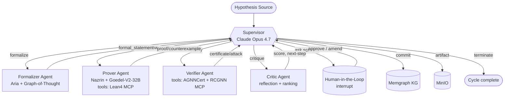

# PLAN — Dijla PoC Scientific Platform

> **Status**: Proof of concept. Real SOTA model backends (Goedel-Prover-V2-32B,
> Aria, Claude Opus 4.7) are wired behind clean adapter interfaces and replaced
> by deterministic mocks in the sandbox. Functional Lean 4, AGNNCert and RCGNN
> MCP servers run in-process via the `mcp` SDK.

## 1. High-level Concept

`dijla` is a self-amplifying spiral platform that executes the **full scientific
method cycle** for the intersection of *formal mathematics* and *graph neural
network certification*. The platform is a **dual core**:

1. **Prover core** — Nazrin Prover + Goedel-Prover-V2 32B: an automated theorem
   prover that proves new theorems about GNN robustness in Lean 4 / mathlib4.
2. **Verifier core** — AGNNCert + RCGNN: deterministic certification of GNN
   robustness against adversarial and node-injection attacks.

Every proved theorem becomes a *blade* for the verifier (a new lemma / tactic
shipped to the certification engine), and every counterexample produced by the
verifier becomes a *challenge* for the prover. The two cores feed each other
through a shared **knowledge graph** stored in Memgraph.

## 2. Multi-Agent Graph (LangGraph Supervisor Pattern)



The state machine is a `StateGraph` over a typed `ScientificState` (Pydantic),
checkpointed in PostgreSQL via `AsyncPostgresSaver` and equipped with a
cross-session `AsyncPostgresStore` for long-term memory of tactics,
counterexamples, and theorems.

## 3. Domain Entities

| Entity | Description |
|---|---|
| `Hypothesis` | A scientific question. Origin: `user`, `system`, `spiral`. |
| `Theorem` | Formalized statement in Lean 4. Status: `open`, `proved`, `refuted`. |
| `Proof` | Sequence of tactics + final `Lean` term. Linked to `Theorem`. |
| `Counterexample` | Concrete GNN/graph instance refuting a `Theorem`. |
| `GNNModel` | Reference to a graph neural network (architecture + weights URI). |
| `Attack` | Adversarial / node-injection attack specification. |
| `Certificate` | Output of AGNNCert / RCGNN: `(model, attack, radius, verdict)`. |
| `Tactic` | Reusable proof tactic shipped to the Lean MCP server. |
| `Cycle` | A run of the spiral. Tracks all events (event-sourced). |
| `Event` | Atomic, immutable record of any agent / tool action. |

## 4. FastAPI Endpoint Plan

```
POST   /api/v1/hypotheses               submit hypothesis
GET    /api/v1/hypotheses/{id}          get hypothesis
GET    /api/v1/hypotheses               list hypotheses
POST   /api/v1/cycles                   start a scientific cycle
GET    /api/v1/cycles/{id}              cycle status + event trail
GET    /api/v1/cycles/{id}/stream       Server-Sent Events of cycle events
POST   /api/v1/cycles/{id}/resume       HITL resume after interrupt
POST   /api/v1/cycles/{id}/cancel       cancel a running cycle
GET    /api/v1/theorems                 list theorems (filter by status)
GET    /api/v1/theorems/{id}            theorem detail + proof
GET    /api/v1/certificates             list certificates
GET    /api/v1/knowledge-graph/query    Cypher passthrough (read-only)
GET    /healthz                         liveness
GET    /readyz                          readiness (DB, MinIO, Memgraph)
GET    /metrics                         Prometheus
```

All write endpoints are async. The `/cycles/*` endpoints support HITL via
LangGraph `interrupt` and a corresponding `resume` payload.

## 5. Testing Strategy

We follow **strict TDD**: tests are written before implementation.

| Layer | Tooling | Coverage Target |
|---|---|---|
| Domain entities | `pytest` value-object + invariant tests | 100% |
| Use cases | `pytest` + in-memory repositories | 100% |
| Agent nodes (unit) | `pytest-asyncio` + frozen LLM mocks | 95% |
| LangGraph end-to-end | `pytest-asyncio` + `InMemorySaver` + mock MCP | 100% |
| MCP servers | `pytest-asyncio` calling MCP tools via stdio | 100% |
| API integration | `httpx.AsyncClient` against `app` | 100% |
| Repositories | `pytest-asyncio` with SQLite/Memgraph mocks | 90% |
| **Overall** | `pytest --cov` (branch + line) | **≥ 85%** |

We use `respx` for HTTP mocking, `freezegun` for time, `hypothesis` for property
tests on the certificate algebra, and `testcontainers` (optional, off by default
in CI) for full PostgreSQL / Memgraph integration locally.

## 6. CI/CD Plan (GitHub Actions)

```
.github/workflows/ci.yml
  jobs:
    lint:         ruff check + ruff format --check
    typecheck:    mypy --strict
    test:         pytest --cov (coverage gate ≥ 85%)
    docker:       docker buildx build (multi-stage)
    compose:      docker compose config (validate)
    secret-scan:  detect-secrets-hook
```

Pre-commit runs `ruff check`, `ruff format`, `mypy`, `detect-secrets`, and the
`pytest -q -m fast` smoke subset.

## 7. Source of Hypotheses

Hypotheses enter the spiral through three doors:

1. **Scientist**: `POST /api/v1/hypotheses` from the UI / curl.
2. **System**: a periodic *Critic* sweep over the Memgraph KG that surfaces
   under-explored regions of the GNN-robustness landscape.
3. **Spiral**: every counterexample from the Verifier or every proved theorem
   is automatically re-enqueued as a new hypothesis ("can we strengthen this
   bound?", "does this tactic generalize to RCGNN?").

## 8. Containers

`docker-compose.yml` brings up: `app` (FastAPI + LangGraph orchestrator),
`postgres` (with the `pgvector` extension preinstalled for future embedding
work), `memgraph` (Memgraph Platform), `minio`, plus three MCP sidecars
(`mcp-lean4`, `mcp-agnncert`, `mcp-rcgnn`). All services have explicit
healthchecks and are accessible on a private bridge network.
